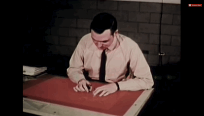
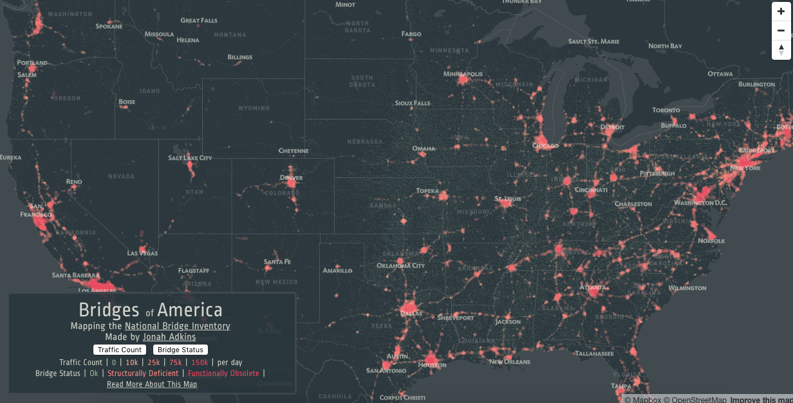

**hey** 👋
---
[@jonahadkins](https://twitter.com/jonahadkins')  
🗺️ cartography, 📊 data viz  

follow along at
[jonahadkins.com/letsmakeamap](http://jonahadkins.com/letsmakeamap/)

---

---
a few things to consider   
---
do you need a **map**? 🤔
---
use color sparingly  
---
normalize your data
---
i could go on for a bit...  
---
now let's make a **map**  
---
basic map components:  
- basemap
- data
- labels
- context (pop-ups, legend, title)
---
most important: a question to answer
---
good news: so many options  
bad news: not enough time
---
we'll be using **OPEN DATA**  and **MAPBOX GL**
---
VDOT Open Data = [Virginia Crash Data](http://www.virginiaroads.org/datasets/virginia-crashes)
---

---

---
you could make some **vector tiles**
---

---
that involves **a lot** more than we need right now
---

---
so now we have some data!
---
**DEMO**
---
we made a **map**!
---
questions?
---
